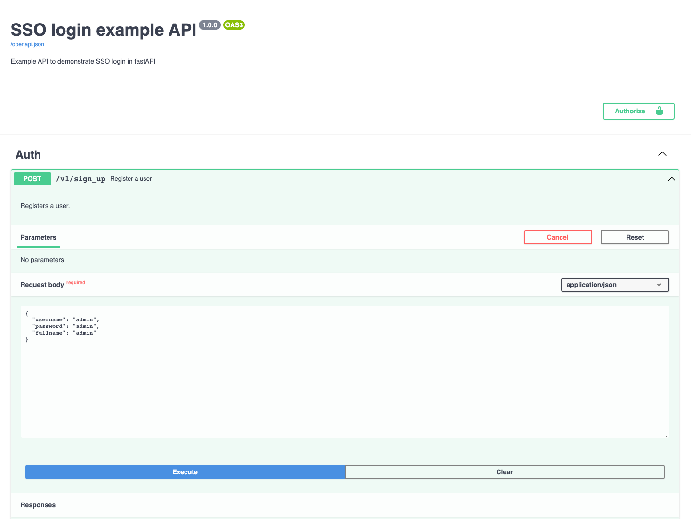

# fastapi-sso-example
FastAPI Single Sign On example with various providers and minimal home page that presents counters for users from each provider 

## Cloud deployed demo
https://fastapi-sso-example.vercel.app/

## Installation

* Create a python virtual environment: `python3.11 -m venv venv`
* Activate the virtual environment: `source venv/bin/activate`
* Install dependencies: `python3.11 -m pip install -r requirements.txt`

## Setup and Configuration

* Create a `.env` file in the project root directory with the keys just like shown in `.env.example`
* Fill the values for each environment variable
* For creating client IDs and secrets for each provider you can follow these guides:
- Google: https://medium.com/itnext/fastapi-google-single-sign-on-sso-47454e2e2859
- Facebook: https://medium.com/@christos.karvouniaris247/fastapi-facebook-single-sign-on-sso-b10865535029
- X (Twitter): https://itnext.io/fastapi-x-twitter-single-sign-on-sso-5725671ad180
- LinkedIn: https://itnext.io/fastapi-linkedin-single-sign-on-sso-b1a0118b02d7
- GitHub: https://medium.com/@christos.karvouniaris247/fastapi-github-single-sign-on-sso-f6b942395649
- GitLab: https://levelup.gitconnected.com/fastapi-gitlab-single-sign-on-sso-624fe442ec56
- Microsoft: https://medium.com/@christos.karvouniaris247/fastapi-microsoft-single-sign-on-sso-d0a0ab248c36
- Spotify: https://medium.com/@christos.karvouniaris247/fastapi-spotify-single-sign-on-sso-4f461b95344c

## Use the project
* While in activated virtual environment, run with: `python3.11 main.py`

## To sign up a local user
Use the swagger documentation at `localhost:9999/v1/documentation`, example:
* 

## Browse in the app
* Visit the user interface in the browser at: `localhost:9999`
* Use form to sign-in with local users
* Use sign-in buttons to sign-in via a provider